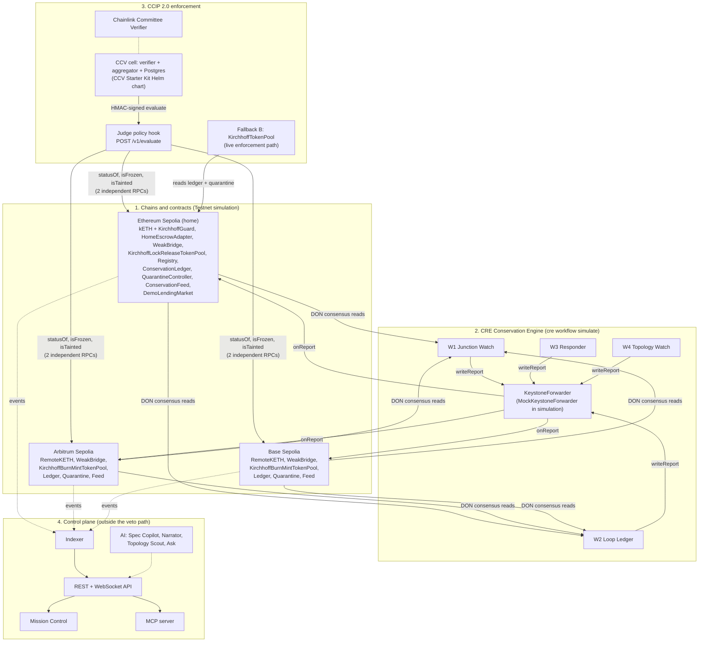

# KIRCHHOFF

**Every bridge checks who signed. KIRCHHOFF checks if the money adds up.**

KIRCHHOFF is a Cross-Chain Verifier (CCV) for Chainlink CCIP 2.0 with a Chainlink CRE Conservation Engine behind it.
It refuses a token transfer when the token's supply stops adding up across chains, whichever bridge broke it.

> **Status, read this first.** Everything on public networks below is a **Testnet simulation** (Ethereum Sepolia,
> Arbitrum Sepolia, Base Sepolia). Two fallbacks are in use and we say so plainly:
>
> 1. **CCV live attestation is not onboarded yet.** Our CCV cell (verifier + aggregator + Judge policy hook) runs in a
>    local k3d cluster, but our CCV resolver is not deployed and kETH's pools do not require it yet
>    ([ccv/STATUS.md](ccv/STATUS.md)). The live CCIP enforcement path is **Fallback B**: `KirchhoffTokenPool`, our
>    CCIP 2.0 token pools that revert inside `lockOrBurn` / `releaseOrMint` (PRD section 9).
> 2. **CRE deploy access is not enabled for our org** (`cre whoami`: `Deploy Access: Not enabled`). The four
>    workflows run with `cre workflow simulate`, which is the path PRD section 8 sanctions. Simulation reports reach
>    the ledgers through Chainlink's `MockKeystoneForwarder`, so the testnet ledgers are in `simulation` forwarder mode.

## Contents

- [The problem](#the-problem)
- [The two rules](#the-two-rules)
- [Architecture](#architecture)
- [How we use Chainlink CRE and CCIP](#how-we-use-chainlink-cre-and-ccip)
- [Deployed contracts (Testnet simulation)](#deployed-contracts-testnet-simulation)
- [CRE workflows](#cre-workflows)
- [Repository layout](#repository-layout)
- [Quickstart (local)](#quickstart-local)
- [Reproduce the Kelp Replay](#reproduce-the-kelp-replay)
- [Test results](#test-results)
- [Measured latency](#measured-latency)
- [Security model](#security-model)
- [What KIRCHHOFF does not protect against](#what-kirchhoff-does-not-protect-against)
- [Honesty notes](#honesty-notes)
- [Docs](#docs)

## The problem

On April 18, 2026, attackers forged a LayerZero message and released about 116,500 rsETH, worth about $292M, from
Kelp DAO's bridge ([Crypto Times](https://www.cryptotimes.io/2026/05/18/crypto-bridge-hacks-top-328m-in-2026-as-cross-chain-exploits-accelerate/)).
The forged message passed because the bridge was configured with a single verifier
([Decrypt](https://decrypt.co/379463)). rsETH holders on 20 chains lost value without ever touching Kelp
([Phemex](https://phemex.com/blogs/defi-hacks-2026-bridge-exploits-explained)), and bridge exploits drained over
$340M across 14 incidents in 2026
([DexTools / PeckShield](https://www.dextools.io/news/crypto-bridge-hacks-340-million-2026-peckshield-alert-june-2026-de)).

Every one of those bridges checked who signed the message. None checked whether the message was economically
possible. A simple sum would have exposed the fake supply the moment it appeared.

CCIP 2.0 (launched September 28, 2026) lets an issuer require its own CCV next to Chainlink's Committee Verifier
([Chainlink](https://chain.link/blog/introducing-ccip-2-0)). KIRCHHOFF is that CCV, and its only job is conservation.

## The two rules

Named after Kirchhoff's circuit laws: what flows out of a junction must equal what flows in.

**Junction Rule (per message, exact).** Every credit `c` (a mint or a release) on any chain must match exactly one
debit `d` (a burn or a lock) such that:

1. `d.messageId == c.messageId` and `d.srcChain == c.claimedSrcChain`
2. `d.token == spec.tokenOn(d.srcChain)` and `d.amount == c.amount` (in canonical base units)
3. `d.recipient == c.recipient` when the bridge carries the recipient
4. `d` is at or below the source chain's required confidence (finalized by default)
5. `d` has not already been consumed by an earlier credit (no double credit, no replay)

A credit with no matching debit on a final source block is `BROKEN` with `DEBIT_NOT_FOUND`. This catches the Kelp
pattern on the first transaction. Code: [`engine/src/junction.ts`](engine/src/junction.ts).

**Loop Rule (global, per epoch).** For a lock-and-release token, with `E` the home escrow at pinned block `b_H`,
`S_i` the remote supply on chain `i` at pinned block `b_i`, `F_out` locked but not yet minted, `F_in` burned but
not yet released, and tolerance `τ` (0 by default):

```
Δ = E_H(b_H) - ( Σ_i S_i(b_i) + F_out + F_in )        BROKEN  iff  Δ < -τ
```

For burn-and-mint tokens: `Σ_i S_i(b_i) + F <= min(I_net, R) + τ`, where `I_net` is net authorized issuance and `R`
is the Proof of Reserve answer. In-flight amounts come from message matching by id, never from snapshot timing.
A donation to the escrow only raises Δ (surplus). Code: [`engine/src/loop.ts`](engine/src/loop.ts).

Both rules live in one pure TypeScript library, `@kirchhoff/engine` (bigint only, no clock, no randomness, no
network), which runs inside the CRE workflows (compiled to WASM), the Judge and the backtester, so all three agree.

## Architecture

Four layers. Only the first three can produce or enforce a verdict; the control plane can be switched off and every
verdict still works. Full diagram and the Flow B sequence: [docs/ARCHITECTURE.md](docs/ARCHITECTURE.md).



`scripts/no-ai-in-veto-path.sh` runs in CI and fails the build if a model SDK or provider shows up in `engine/`,
`judge/`, `contracts/` or `workflows/`.

## How we use Chainlink CRE and CCIP

### CRE: the Conservation Engine

Four TypeScript workflows (`@chainlink/cre-sdk` 1.23.0, CRE CLI v1.36.0) do all the computing
([workflows/README.md](workflows/README.md)).

| Workflow | Triggers | CRE capabilities used | Writes (via `writeReport` to the forwarder) |
| --- | --- | --- | --- |
| W1 Junction Watch | EVM Log trigger per chain on every credit event (WeakBridge / HomeEscrowAdapter `Released`, CCIP OffRamp `ExecutionStateChanged`) | `headerByNumber` (finalized pin), `callContract` (`debitOf` at the pin, `isConsumed`), `filterLogs` (evidence window), `getTransactionReceipt` (CCIP credits) | `BREACH` to the ledger on all three chains in the same run |
| W2 Loop Ledger | Cron `*/30 * * * * *` plus EVM Log triggers on supply-changing `Transfer` events | `headerByNumber` per chain, one Multicall3 `callContract` per chain at the pinned block, `filterLogs` for in-flight matching | `EPOCH` (CONSERVED or DRIFT, settled ids), `BREACH` (`LOOP_DEFICIT`), `RECOVERY_CHECK` |
| W3 Responder | EVM Log trigger on `BreachRecorded` (home ledger) | Multicall3 `callContract`, HTTP capability with `Idempotency-Key` = incident id, CRE secrets | `QUARANTINE_APPLIED` (tainted recipients) on every ledger whose active incident it is |
| W4 Topology Watch | EVM Log trigger on `SpecActivated`, Cron every 10 minutes, `RoleGranted(MINTER_ROLE)` on the remotes | `filterLogs` over `RoleGranted`, Multicall3 `hasRole` | `EPOCH` DRIFT with `SPEC_MISMATCH` when a minter outside the spec appears |

Reports reach `ConservationLedger.onReport(metadata, report)` only through the `KeystoneForwarder`
(`MockKeystoneForwarder` in simulation). `CREReceiver` keeps Chainlink's `ReceiverTemplate` metadata decoding and
replaces the single expected workflow id with an allowlist `workflowId -> (owner, name, allowed report types)`. Every
report carries the chain selector and the ledger address, so a report built for another chain or ledger is rejected.
A CRE report alone can never clear `BROKEN`: only the issuer Safe can start recovery.

Every run stays inside the CRE per-execution limits (15 EVM reads, 100 blocks per `filterLogs`); each run logs its
read budget, for example `W2 reads used 12/15` ([workflows/SIMULATION_LOG.md](workflows/SIMULATION_LOG.md)).
Workflow configs are generated from the KIRCH-SPEC by `engine/src/compile.ts`; nobody edits them by hand.

### CCIP 2.0: the verifier and the pools

- **CCV policy hook (the Judge).** Built against the chainlink-ccv policy hook OpenAPI v1 spec (copied verbatim into
  `judge/openapi/`). HMAC-SHA256 verified, two independent RPC providers per chain, 2 s budget, every reason code in
  PRD section 6. It runs inside a CCV cell built from the official CCV Starter Kit Helm chart (`ccv-cell` v0.8.0,
  verifier and aggregator images v0.13.0).
- **Fallback B, KirchhoffTokenPool.** `KirchhoffLockReleaseTokenPool` (home) and `KirchhoffBurnMintTokenPool`
  (remotes) subclass the unmodified CCIP 2.0.0 `LockReleaseTokenPool` / `BurnMintTokenPool` and override the
  validation choke points every `lockOrBurn` / `releaseOrMint` passes through. They allow only CONSERVED or DRIFT with
  a fresh status, no frozen lanes, and no tainted sender or receiver. kETH is registered as a Cross-Chain Token
  through the self-serve TokenAdminRegistry flow on all three testnets.
- **CCIP message matching.** CCIP 2.0.0 pool events carry no message id, so the `ccip_v2` adapter pairs
  `LockedOrBurned` with the OnRamp `CCIPMessageSent` in the same transaction, and `ReleasedOrMinted` with the OffRamp
  `ExecutionStateChanged` (docs/INTERFACES.md Revision 2).

## Deployed contracts (Testnet simulation)

From [deployments/testnet.json](deployments/testnet.json) and `deployments/testnet-{home,arb,base}.raw.json`
(written by `contracts/script/Deploy.s.sol`). Source verification was checked on 2026-10-05 through the Etherscan V2
API: every contract below is verified on the linked explorer. The Arbitrum Sepolia `ConservationFeed` is verified on
Blockscout only, so its link points there. Ledgers are in `simulation` forwarder mode (`forwarderMode() == 1`).

kETH `tokenId` = `keccak256("kETH")` = `0xe7cbc0ff4035309f71987d099a88ed33ef6bfd1a7d6c1050befb12561b95eb9c`.

### Ethereum Sepolia (home, chain id 11155111, selector 16015286601757825753)

| Contract | Address |
| --- | --- |
| ConservationLedger | [`0x05fE18C1cb1FF308aF668a7abaAf6Ac3f623B5D3`](https://sepolia.etherscan.io/address/0x05fE18C1cb1FF308aF668a7abaAf6Ac3f623B5D3#code) |
| QuarantineController | [`0xA3c539ccE9b4E6caCe97E8f4FD1346e1D885aC4a`](https://sepolia.etherscan.io/address/0xA3c539ccE9b4E6caCe97E8f4FD1346e1D885aC4a#code) |
| ConservationFeed | [`0x93EEc1BA5a782ceB99e76Eec6736D900c1cB002d`](https://sepolia.etherscan.io/address/0x93EEc1BA5a782ceB99e76Eec6736D900c1cB002d#code) |
| KirchhoffRegistry (10 minute testnet timelock) | [`0x98Ec613f16CF077De8b34a7C32f4b767cc90840e`](https://sepolia.etherscan.io/address/0x98Ec613f16CF077De8b34a7C32f4b767cc90840e#code) |
| KirchhoffGuard | [`0x9bB3062C74C97768b83F48AC2F2bAe38A1dB5D78`](https://sepolia.etherscan.io/address/0x9bB3062C74C97768b83F48AC2F2bAe38A1dB5D78#code) |
| KirchhoffLockReleaseTokenPool (Fallback B) | [`0x1c60f8B189E6Ea5F04C9510fAef5021605a22BDe`](https://sepolia.etherscan.io/address/0x1c60f8B189E6Ea5F04C9510fAef5021605a22BDe#code) |
| ERC20LockBox (CCIP escrow) | [`0x8fa18a722eED4ef8C40C2552b92Db07ccdD6f899`](https://sepolia.etherscan.io/address/0x8fa18a722eED4ef8C40C2552b92Db07ccdD6f899) |
| kETH (demo) | [`0xb270dcD4f512709DFAedBAab736888699BDa0273`](https://sepolia.etherscan.io/address/0xb270dcD4f512709DFAedBAab736888699BDa0273#code) |
| HomeEscrowAdapter (demo) | [`0xdE9A6413AC2C29Cd6621f93FCD872eBB46b6a3D7`](https://sepolia.etherscan.io/address/0xdE9A6413AC2C29Cd6621f93FCD872eBB46b6a3D7#code) |
| WeakBridge (demo, 1-of-1 verifier) | [`0x69B5096bA712A4dbc68d12408199dAD777Bb656d`](https://sepolia.etherscan.io/address/0x69B5096bA712A4dbc68d12408199dAD777Bb656d#code) |
| DemoLendingMarket (demo) | [`0xE7d8ab11A07B2b4A913a1B04Ff17640e812Dc72A`](https://sepolia.etherscan.io/address/0xE7d8ab11A07B2b4A913a1B04Ff17640e812Dc72A#code) |
| DemoUSD (demo) | [`0x13285199088416c76B5376EAaCb48625791fcAb3`](https://sepolia.etherscan.io/address/0x13285199088416c76B5376EAaCb48625791fcAb3#code) |
| Issuer Safe (2 of 3) | [`0x1fdF6047B937b9536E6C2e2e01849D391cEAfc46`](https://sepolia.etherscan.io/address/0x1fdF6047B937b9536E6C2e2e01849D391cEAfc46) |
| MockKeystoneForwarder (Chainlink, simulation) | [`0x15fC6ae953E024d975e77382eEeC56A9101f9F88`](https://sepolia.etherscan.io/address/0x15fC6ae953E024d975e77382eEeC56A9101f9F88) |

### Arbitrum Sepolia (chain id 421614, selector 3478487238524512106)

| Contract | Address |
| --- | --- |
| ConservationLedger | [`0xe4908004644C0f52Ea56Ce747AAcc08B693A4aE0`](https://sepolia.arbiscan.io/address/0xe4908004644C0f52Ea56Ce747AAcc08B693A4aE0#code) |
| QuarantineController | [`0xFC052cdb453D3fB94770a88A4C1F03cB5CE84E2f`](https://sepolia.arbiscan.io/address/0xFC052cdb453D3fB94770a88A4C1F03cB5CE84E2f#code) |
| ConservationFeed (verified on Blockscout) | [`0xbf31A944Dc417a8BF1b167FE6362d2404FE06F96`](https://arbitrum-sepolia.blockscout.com/address/0xbf31A944Dc417a8BF1b167FE6362d2404FE06F96?tab=contract) |
| KirchhoffGuard | [`0xa2B051D83c953293ed425D7042551b83E986C37D`](https://sepolia.arbiscan.io/address/0xa2B051D83c953293ed425D7042551b83E986C37D#code) |
| KirchhoffBurnMintTokenPool (Fallback B) | [`0x98Ec613f16CF077De8b34a7C32f4b767cc90840e`](https://sepolia.arbiscan.io/address/0x98Ec613f16CF077De8b34a7C32f4b767cc90840e#code) |
| RemoteKETH (demo) | [`0x93EEc1BA5a782ceB99e76Eec6736D900c1cB002d`](https://sepolia.arbiscan.io/address/0x93EEc1BA5a782ceB99e76Eec6736D900c1cB002d#code) |
| WeakBridge (demo) | [`0x9bB3062C74C97768b83F48AC2F2bAe38A1dB5D78`](https://sepolia.arbiscan.io/address/0x9bB3062C74C97768b83F48AC2F2bAe38A1dB5D78#code) |
| MockKeystoneForwarder (Chainlink, simulation) | [`0xD41263567DdfeAd91504199b8c6c87371e83ca5d`](https://sepolia.arbiscan.io/address/0xD41263567DdfeAd91504199b8c6c87371e83ca5d) |

### Base Sepolia (chain id 84532, selector 10344971235874465080)

| Contract | Address |
| --- | --- |
| ConservationLedger | [`0xe4908004644C0f52Ea56Ce747AAcc08B693A4aE0`](https://sepolia.basescan.org/address/0xe4908004644C0f52Ea56Ce747AAcc08B693A4aE0#code) |
| QuarantineController | [`0xFC052cdb453D3fB94770a88A4C1F03cB5CE84E2f`](https://sepolia.basescan.org/address/0xFC052cdb453D3fB94770a88A4C1F03cB5CE84E2f#code) |
| ConservationFeed | [`0xbf31A944Dc417a8BF1b167FE6362d2404FE06F96`](https://sepolia.basescan.org/address/0xbf31A944Dc417a8BF1b167FE6362d2404FE06F96#code) |
| KirchhoffGuard | [`0xa2B051D83c953293ed425D7042551b83E986C37D`](https://sepolia.basescan.org/address/0xa2B051D83c953293ed425D7042551b83E986C37D#code) |
| KirchhoffBurnMintTokenPool (Fallback B) | [`0x98Ec613f16CF077De8b34a7C32f4b767cc90840e`](https://sepolia.basescan.org/address/0x98Ec613f16CF077De8b34a7C32f4b767cc90840e#code) |
| RemoteKETH (demo) | [`0x93EEc1BA5a782ceB99e76Eec6736D900c1cB002d`](https://sepolia.basescan.org/address/0x93EEc1BA5a782ceB99e76Eec6736D900c1cB002d#code) |
| WeakBridge (demo) | [`0x9bB3062C74C97768b83F48AC2F2bAe38A1dB5D78`](https://sepolia.basescan.org/address/0x9bB3062C74C97768b83F48AC2F2bAe38A1dB5D78#code) |
| MockKeystoneForwarder (Chainlink, simulation) | [`0x82300bd7c3958625581cc2F77bC6464dcEcDF3e5`](https://sepolia.basescan.org/address/0x82300bd7c3958625581cc2F77bC6464dcEcDF3e5) |

Same-looking addresses on different chains are different contracts: the deployer's nonces line up across chains.

**Onchain state today (read 2026-10-05 with `cast call ... statusOf(tokenId)`):** all three ledgers report
`UNKNOWN` with no epoch yet, and the registry has no active kETH spec (`activeSpecHash` is zero). The testnet Kelp
Replay has not been run yet; see [PRD_TRACEABILITY.md](PRD_TRACEABILITY.md) "Pending work".

## CRE workflows

| Workflow | CRE workflow name | Directory |
| --- | --- | --- |
| W1 Junction Watch | `kirchhoff-w1-junction` | [workflows/w1-junction](workflows/w1-junction) |
| W2 Loop Ledger | `kirchhoff-w2-loop` | [workflows/w2-loop](workflows/w2-loop) |
| W3 Responder | `kirchhoff-w3-responder` | [workflows/w3-responder](workflows/w3-responder) |
| W4 Topology Watch | `kirchhoff-w4-topology` | [workflows/w4-topology](workflows/w4-topology) |

**Workflow ids.** Live deploy access is pending, so there are no DON workflow ids yet. In simulation the CRE CLI uses
the fixed workflow id `0x1111111111111111111111111111111111111111111111111111111111111111` and owner
`0xaaaaaaaaaaaaaaaaaaaaaaaaaaaaaaaaaaaaaaaa`, and the simulation-mode ledgers pin exactly that metadata
([contracts/README.md](contracts/README.md), "Deploying"). For a live deploy, CRE allows 3 workflows per org, so W4's
handlers run inside W2 (docs/INTERFACES.md Revision 2, item 6); production ids come from `cre workflow hash` and are
passed to `Deploy.s.sol` as `WORKFLOW_ID_W1/W2/W3`.

## Repository layout

```
contracts/   Foundry: production suite, Fallback B pools, demo suite (Testnet simulation), tests, deploy scripts
engine/      @kirchhoff/engine: Junction and Loop rules, status machine, Judge core, adapters, spec compiler
workflows/   CRE workflows W1 to W4, generated configs, scenario harness, SIMULATION_LOG.md
judge/       CCV policy hook service (POST /v1/evaluate), load and chaos results
ccv/         CCV Starter Kit Helm values per cell, k8s manifests, cell scripts, STATUS.md
indexer/     Event indexer to Postgres (UI read model only) and the notifier
api/         REST + WebSocket API, Attack Lab runner, internal verdict ingest
ai/          Spec Copilot, Incident Narrator, Topology Scout, Ask KIRCHHOFF, eval suite
mcp/         MCP server (stdio and Streamable HTTP, read-only tools)
sdk/         @kirchhoff/sdk
web/         Mission Control (Next.js 15)
demo/        deploy-all, seed, attack-kelp-replay, reset, e2e, verify
deployments/ Addresses per network
docs/        PRD, frozen interfaces, research notes, architecture
```

## Quickstart (local)

Requirements: Node 22 or later (CI uses 24), pnpm, Foundry, Bun (for CRE), the CRE CLI logged in (`cre login`),
Docker for Postgres.

```bash
cp .env.example .env          # fill in, or run: make wallets && make secrets
make check-creds              # green/red table of every credential
make install                  # pnpm install + contracts npm ci
make anvil                    # 3 local chains: home 8545/31337, arb 8546/31338, base 8547/31339
make deploy-local             # pnpm --filter @kirchhoff/demo deploy-all --network local
pnpm --filter @kirchhoff/demo e2e --network local   # full Kelp Replay with assertions, then reset
```

Run the whole test suite with `make test` (pnpm workspaces plus `forge test`) and the engine coverage gate with
`make coverage`.

## Reproduce the Kelp Replay

Labeled **Testnet simulation** throughout. The forgery is a WeakBridge credit signed by the bridge's single
verifier key with no matching burn. It reproduces the effect of the Kelp forgery (a credit with no debit), not
LayerZero's exact bug.

### Local (3 Anvil chains)

```bash
make anvil
make deploy-local
pnpm --filter @kirchhoff/demo seed --network local      # Flow A: normal CCIP and WeakBridge traffic, W2 baseline
pnpm --filter @kirchhoff/demo attack --network local    # Flow B: the Kelp Replay
pnpm --filter @kirchhoff/demo reset --network local     # back to a clean, conserved state
```

What `attack` does, step by step (code: [demo/src/attack.ts](demo/src/attack.ts)):

1. The attacker submits a WeakBridge credit for 116,500 kETH signed by the single verifier key, with no burn on any
   chain. `HomeEscrowAdapter` releases 116,500 kETH on the home chain.
2. W1 runs with `cre workflow simulate --broadcast` on that `Released` log, finds no debit (`debitOf(id)` at the
   finalized pin is zero) and writes `BREACH` (`DEBIT_NOT_FOUND`) to all three ledgers in the same run.
3. W3 runs on `BreachRecorded`: `QUARANTINE_APPLIED` on all three ledgers, attacker tainted, lanes frozen, the
   Conservation Feed answers QUARANTINED.
4. The attacker tries to move kETH to Base Sepolia through CCIP: the Fallback B pool refuses. Today the script
   calls the pool's public `kirchhoffCheck(sender, receiver)`, the same check `lockOrBurn` runs, and asserts the
   revert. A full `ccipSend` through the router is pending (see the traceability matrix). The script also builds the
   policy hook request for this message; the Judge answers it FAIL `TOKEN_QUARANTINED` (Fallback C, Judge replay).
5. The attacker tries a plain kETH transfer: `KirchhoffGuard` reverts. `DemoLendingMarket.borrow()` reverts
   `CollateralBroken()`.
6. W2's next epoch computes Δ = -116,500 kETH (`LOOP_DEFICIT`).

`--reports direct` writes the identical report bytes through each chain's MockKeystoneForwarder instead of running
the CRE simulator. It is a named fallback for machines without the CRE CLI, not the default.

The Attack Lab (`/lab` in Mission Control) runs the same script through the API and streams each step with its
explorer link.

### Public testnets

```bash
make deploy-testnets          # idempotent: reuses every recorded address that still has code
pnpm --filter @kirchhoff/demo spec --network testnet      # issuer Safe proposes and activates the kETH spec (10 min timelock)
pnpm --filter @kirchhoff/workflows gen-config --target staging
pnpm --filter @kirchhoff/demo seed --network testnet
make e2e                      # demo e2e --network testnet: BREACH on 3 chains, CCIP refusal, Guard and borrow reverts, incident
make reset
```

Every step prints the explorer link of its transaction. Pacing: a finalized CCIP message on Ethereum Sepolia reaches
a CCV verifier roughly 13 to 17 minutes after the send ([docs/research/ccip.md](docs/research/ccip.md) section 8).

## Test results

Measured on 2026-10-05 on the current working tree (`pnpm -r --no-bail test`, `pnpm --filter @kirchhoff/engine
coverage`, `cd contracts && forge test`). All green.

| Package | Command | Result |
| --- | --- | --- |
| Engine | `pnpm --filter @kirchhoff/engine test` | 249 passed (14 files) |
| Engine coverage | `pnpm --filter @kirchhoff/engine coverage` | 100% statements (894/894), branches (586/586), functions (203/203), lines (736/736) |
| Engine property test | `engine/test/property.test.ts` "holds over 10,000 random histories" | 10,000 runs (`numRuns: 10_000`): every forgery flagged, zero false flags on valid traffic |
| Contracts | `cd contracts && forge test` | 150 passed, 0 failed (10 suites: unit, fuzz at 1024 runs, invariants at 256 runs x depth 64, real KeystoneForwarder signature path) |
| Workflows | `pnpm --filter @kirchhoff/workflows test` | 35 passed |
| Workflows, six PRD scenarios | `pnpm --filter @kirchhoff/workflows scenarios` (`cre workflow simulate --broadcast` on 3 Anvil chains) | 6 / 6 PASS ([SIMULATION_LOG.md](workflows/SIMULATION_LOG.md), run 2026-10-03) |
| Judge | `pnpm --filter @kirchhoff/judge test` | 96 passed, 3 skipped (the skipped ones need `JUDGE_LIVE=1` and live Sepolia RPCs) |
| AI | `pnpm --filter @kirchhoff/ai test` | 33 passed |
| API | `pnpm --filter @kirchhoff/api test` | 20 passed |
| Indexer | `pnpm --filter @kirchhoff/indexer test` | 8 passed |
| SDK | `pnpm --filter @kirchhoff/sdk test` | 8 passed |
| MCP | `pnpm --filter @kirchhoff/mcp test` | 6 passed |
| Demo | `pnpm --filter @kirchhoff/demo test` | 8 passed |
| Web | `pnpm --filter @kirchhoff/web test` (typecheck) | passes; Playwright suites in `web/e2e` (last recorded report covers the console-error suite only, 13 / 13) |
| AI evals | `ai/eval/run.ts` ([RESULTS.md](ai/eval/RESULTS.md), 2026-10-05) | provenance 100%, field accuracy 19 / 19, narrator citations 100%, prompt injection 0 of 10 misuse |
| No AI in veto path | `bash scripts/no-ai-in-veto-path.sh` | OK |

## Measured latency

Every number here was measured; the file that holds the raw output is linked.

| What | Result | Source |
| --- | --- | --- |
| Judge at 100 rps, in-process stub RPCs (k6, 60 s) | p50 3.64 ms, p99 6.13 ms, 0 of 6001 failed | [judge/load/RESULTS.md](judge/load/RESULTS.md) run A |
| Judge at 100 rps, 3 private Anvil chains | p50 3.46 ms, p99 485.9 ms (misses the 300 ms target; the tail is Anvil, see the file) | [judge/load/RESULTS.md](judge/load/RESULTS.md) run B |
| Judge, single signed request against the live testnet deployment | 21.3 to 26.6 ms | [judge/README.md](judge/README.md) "Live testnet check" |
| Judge debit lookup through two keyless public Sepolia RPCs | 397 to 677 ms per message | [judge/load/RESULTS.md](judge/load/RESULTS.md) "Against real testnet RPCs" |
| Judge under chaos (provider killed, W2 paused) | every answer inside 11 ms, PENDING as HTTP 503 | [judge/CHAOS.md](judge/CHAOS.md) |
| Forged credit to BREACH | same W1 run as the credit event (scenario 3) | [workflows/SIMULATION_LOG.md](workflows/SIMULATION_LOG.md) |
| Loop Rule breach to BROKEN onchain, in seconds | pending measurement | |
| Spec Copilot onboarding time for kETH | pending measurement | |

## Security model

Design law: nothing we operate alone can produce a verdict. Verdicts come only from CRE DON consensus data, onchain
state, and a deterministic Judge that each CCV cell runs independently.

| Threat (PRD section 14) | Response in this repo |
| --- | --- |
| Forged message on a non-CCIP bridge (the Kelp pattern) | W1 Junction Rule, BREACH on every chain, lanes frozen, recipient tainted, feed flips |
| Forged or buggy CCIP message | Judge checks the source pool debit for the message id independently of the Committee Verifier |
| Compromised mint key minting with no message | W2 Loop Rule (`LOOP_DEFICIT`) and W4 unlisted-minter alert (`SPEC_MISMATCH`) |
| Replay or double credit | Junction consumed set (`DOUBLE_CREDIT`), consumed ids recorded on the ledger |
| Lying or eclipsed RPC | DON consensus in CRE; two independent providers per Judge, disagreement is HTTP 503 (retry) |
| Chain reorg | Finalized confidence by default |
| Spec poisoning | Issuer Safe plus timelock (48 h in production, 10 minutes on testnet) |
| Report replay across chains or ledgers | chain selector and ledger address in every report, enforced by the ledger |
| KIRCHHOFF operator compromise | Operator cannot release containment; only the issuer Safe can resolve. Production needs 3 of 4 independent cells |
| Malicious AI suggestion or prompt injection | No write tools, provenance required, 10-case injection suite with 0 misuse |

## What KIRCHHOFF does not protect against

- Theft of real assets that keeps supply conserved, for example a social-engineered admin draining a protocol's own
  vault.
- DEX price manipulation, phishing, or bugs in lending logic.
- Swaps an attacker makes in the same block as the forged release, unless the token uses KirchhoffGuard.
- The first fraudulent release on a bridge KIRCHHOFF does not sit on. It contains it within one CRE run; it cannot
  undo it.

## Honesty notes

- **Testnet simulation.** All public deployments are testnet demos. kETH, RemoteKETH, WeakBridge, HomeEscrowAdapter,
  DemoLendingMarket and DemoUSD are demo contracts, labeled `TESTNET SIMULATION ONLY` in their NatSpec.
- **The forgery is a WeakBridge single-key signature.** We sign a WeakBridge credit with its one verifier key and no
  matching burn. That reproduces the effect of the Kelp exploit, not LayerZero's bug.
- **Fallback B is the live CCIP enforcement path.** The CCV cell runs one cell (threshold 1) in a local k3d cluster
  with the Judge wired as its policy hook. It cannot attest kETH messages until our CCV resolver is deployed, kETH's
  pools require it (`applyCCVConfigUpdates`, not wired yet), and the aggregator is reachable over public TLS. Indexer
  onboarding is not self-serve, so messages would be executed with `ccip-cli manual-exec`.
- **CRE runs in simulation.** Deploy access is not enabled for our org. Simulation is single node, and its forwarder
  is Chainlink's permissionless `MockKeystoneForwarder`, so a simulation-mode ledger can be written by anyone who
  forges the simulator's metadata. The production `KeystoneForwarder` path (DON signatures) is covered by
  `contracts/test/ForwarderIntegration.t.sol`.
- **Judge latency target.** p99 under 300 ms at 100 rps is met with stub RPCs and missed on a contended laptop with
  Anvil backends. Both results are reported.
- **AI** never decides a verdict. The AI provider used for the evals is Claude through OpenRouter, temperature 0.

## Docs

- [PRD](docs/PRD.md) and [traceability matrix](PRD_TRACEABILITY.md)
- [Architecture and Flow B sequence](docs/ARCHITECTURE.md)
- [Frozen interfaces, incl. Revision 2](docs/INTERFACES.md)
- Research: [CRE](docs/research/cre.md), [CRE contracts](docs/research/cre-contracts.md), [CCIP](docs/research/ccip.md), [CCV](docs/research/ccv.md), [explorers](docs/research/explorers.md)
- [contracts/README.md](contracts/README.md), [workflows/README.md](workflows/README.md), [judge/README.md](judge/README.md), [ccv/README.md](ccv/README.md), [ccv/STATUS.md](ccv/STATUS.md)
- [Submission](SUBMISSION.md), [human tasks](HUMAN_TASKS.md), [credentials](CREDENTIALS_NEEDED.md)
